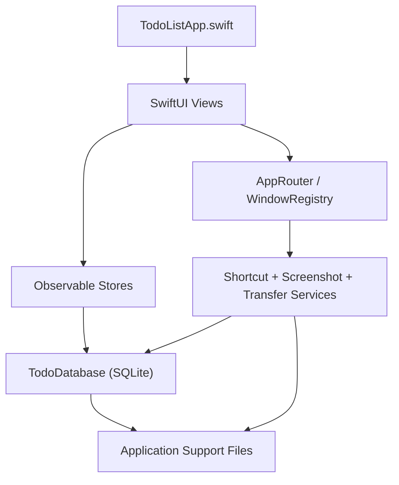

# Todo List Native Design

## Problem Definition

This repository started as a Tauri + React desktop TODO app. The active product has now moved to a native macOS implementation under `apple/TodoList`.

The design target is no longer "cross-platform shell plus web UI". The current target is:

- native macOS windowing and menu bar behavior
- local-first persistence with SQLite
- keyboard-first capture flow
- compatibility with the earlier JSON backup shape

## Current Scope

### In Scope

- Dashboard window with sidebar, task list, and detail pane
- Menu bar extra
- Quick Add floating panel
- Task CRUD, tag CRUD, status and priority updates
- JSON import/export
- Global shortcuts
- Screen capture attachment flow
- Appearance and Dock visibility settings

### Out of Scope

- Windows shipping path
- Tauri runtime as the primary app host
- Rust bridge integration

## Architecture



## Code Layout

```text
apple/TodoList/Sources/
├── App/
│   └── TodoListApp.swift
├── Data/
│   └── TodoDatabase.swift
├── Models/
│   └── TodoModels.swift
├── Stores/
│   ├── AppSettingsStore.swift
│   └── TodoStore.swift
├── Support/
│   ├── AppRouter.swift
│   ├── DataTransferService.swift
│   ├── GlobalShortcutManager.swift
│   ├── QuickAddPanelController.swift
│   ├── ScreenshotService.swift
│   ├── WindowBridge.swift
│   └── WindowRegistry.swift
└── Views/
    ├── MenuBarDashboardView.swift
    ├── QuickAddPanelView.swift
    ├── RootView.swift
    ├── SettingsView.swift
    ├── SidebarView.swift
    ├── TodoDetailView.swift
    └── TodoListView.swift
```

## Data Model

The native app keeps the earlier SQLite model shape so migration remains cheap and JSON backups stay compatible.

### Tables

- `todos`
  Stores title, notes, screenshot path, due date, status, timestamps, and priority.
- `tags`
  Stores tag name and color.
- `todo_tags`
  Stores many-to-many relations between tasks and tags.
- `settings`
  Stores appearance mode, global shortcuts, and Dock visibility.

### Key Settings

- `shortcut_quick_input`
- `shortcut_show_list`
- `appearance_mode`
- `hide_dock_icon`

### Runtime Paths

- Database:
  `~/Library/Application Support/com.todolist.app/todo.db`
- Screenshot directory:
  `~/Library/Application Support/com.todolist.app/screenshots/`

## Main Flows

### App Bootstrap

1. `TodoListApp` creates `TodoDatabase`, `TodoStore`, `AppSettingsStore`, and `AppRouter`.
2. The dashboard window mounts `RootView`.
3. `AppSettingsStore.bootstrap` loads persisted settings, applies appearance and Dock policy, then registers global shortcuts.
4. `TodoStore` reloads the database snapshot and populates sidebar, list, and detail state.

### Quick Add

1. User opens Quick Add from shortcut, menu bar, or Settings.
2. `QuickAddPanelController` presents a dedicated floating window.
3. `QuickAddPanelView` edits a `TodoDraft`.
4. Optional screenshot capture runs through `ScreenshotService`.
5. Saving the draft calls `TodoStore.createTodo(from:)`, which persists through `TodoDatabase.insertTodo(...)`.

### Dashboard Navigation

1. Sidebar selection is stored in `TodoStore.selectedSection` or `selectedTagID`.
2. `visibleTodos` recomputes from the active scope plus search text.
3. `selectedTodo` reconciles against the filtered result set.
4. Detail pane renders the active task without duplicating persistence logic.

### Import / Export

1. `DataTransferService` opens a system panel or accepts a direct file URL.
2. Export serializes `TodoTransferBundle`.
3. Import decodes the same bundle shape and rehydrates tags plus todos through `TodoDatabase.importBundle(...)`.

### Global Shortcuts

1. Shortcut strings are parsed by `ShortcutParser`.
2. `GlobalShortcutManager` registers Carbon hotkeys.
3. Hotkey events route into `AppRouter`.
4. Router opens dashboard or Quick Add and emits telemetry.

### Screenshot Permission

1. Permission check uses `CGPreflightScreenCaptureAccess()`.
2. Request flow uses `CGRequestScreenCaptureAccess()`.
3. If access is still missing, the app opens the Screen Recording System Settings page.
4. Interactive capture uses `/usr/sbin/screencapture -i -x`.

## Verification Strategy

### Build Verification

```bash
swift build --package-path apple/TodoList
```

### Packaged App Verification

```bash
./tools/native/build_and_run.sh --verify
```

### Runtime Telemetry

```bash
./tools/native/build_and_run.sh --telemetry
```

This is the fastest way to confirm:

- shortcuts are registered
- router actions fire
- dashboard and Quick Add windows are being requested

### Migration Smoke

```bash
./tools/native/verify_native_migration.sh
```

The smoke verifier checks:

- default settings values
- Quick Add persistence
- tag relation persistence
- screenshot path persistence
- import/export JSON round-trip

## Legacy Code Boundary

The following folder is no longer the primary delivery path:

- `tauri/`

Inside that legacy boundary you will still find the earlier React UI, Tauri backend, and Rust bridge experiments.

They remain useful for:

- historical reference
- backup format compatibility
- icon asset generation

Product changes should default to `apple/TodoList` unless the task explicitly targets legacy code under `tauri/`.

## Related Docs

- [Repo overview](../README.md)
- [Native app notes](../apple/README.md)
- [Migration progress](native-migration-progress-2026-04-20.md)
